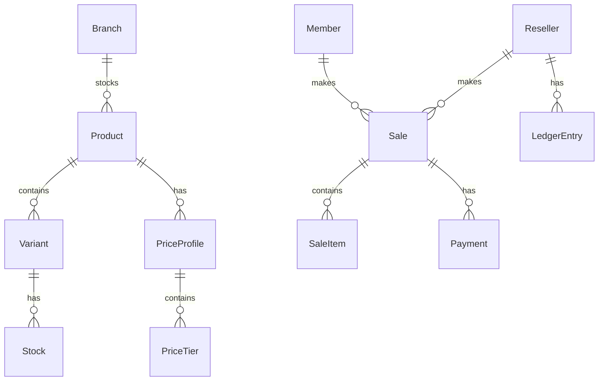

# BLESSCENT Retail POS System - Implementation Plan

## Architecture Overview
- **Architecture Style**: Hybrid retail with offline-first POS
- **Backend**: Node.js with NestJS
- **Database**: PostgreSQL with SQLite for offline POS
- **Frontend**: Next.js for admin/reseller portals, React Native/Windows for POS

---

## Phase 1: Database Schema & Core Infrastructure

### 1.1 Database Design
- [ ] Create PostgreSQL database schema
- [ ] Define core entities with relationships
- [ ] Implement soft delete patterns
- [ ] Add audit trail tables
- [ ] Create database migrations structure

### 1.2 Core Entity Definitions


---

## Phase 2: Core Backend Services

### 2.1 Auth Service
- [ ] User management (admin, manager, cashier, inventory roles)
- [ ] JWT authentication with role-based access
- [ ] POS-limited scope tokens
- [ ] Dashboard full-scope tokens
- [ ] Password reset & session management

### 2.2 Product Service
- [ ] Perfume product CRUD operations
- [ ] Variant management (size, concentration, packaging)
- [ ] Bundle/product set support
- [ ] Product image handling (object storage)
- [ ] Category & brand management

### 2.3 Inventory Service
- [ ] Stock management per branch
- [ ] Stock-in/stock-out transactions
- [ ] Stock adjustment & audit logging
- [ ] Low stock alerts
- [ ] Stock count reconciliation

### 2.4 Pricing Service
- [ ] PriceProfile management (retail, member, reseller, promo)
- [ ] Dynamic pricing rules engine
- [ ] Promo pricing schedules
- [ ] Price tier calculations
- [ ] Historical pricing tracking

---

## Phase 3: Sales & Commerce Services

### 3.1 Sales Service
- [ ] POS sale creation with offline support
- [ ] Sale validation & pricing calculation
- [ ] Sale cancellation & refunds
- [ ] Receipt generation
- [ ] Sales analytics aggregation

### 3.2 Member Service
- [ ] Member registration & profile management
- [ ] Points accumulation & redemption
- [ ] Member tier management
- [ ] Purchase history tracking
- [ ] Member lookup API

### 3.3 Reseller Service
- [ ] Reseller account management
- [ ] Price level assignments
- [ ] Credit limit management
- [ ] Reseller tier discounts
- [ ] Account status & approval workflow

---

## Phase 4: Financial Services

### 4.1 Ledger Service
- [ ] Reseller credit management
- [ ] Payment recording & tracking
- [ ] Balance calculations
- [ ] Payment reconciliation
- [ ] Credit limit enforcement
- [ ] Transaction audit trail

---

## Phase 5: Sync & Offline Support

### 5.1 Sync API Design
- [ ] Push local transactions endpoint
- [ ] Pull master data endpoint
- [ ] Conflict resolution (server wins for stock)
- [ ] Sync status tracking
- [ ] Idempotent operations

### 5.2 Offline POS Database
- [ ] SQLite schema design
- [ ] Local tables: products, prices, members, resellers, stock, sales, payments
- [ ] Sync queue management
- [ ] Offline transaction logging
- [ ] Data merge strategies

---

## Phase 6: Reporting & Analytics

### 6.1 Report Service
- [ ] Sales reports (daily, weekly, monthly)
- [ ] Inventory reports
- [ ] Member analytics
- [ ] Reseller performance
- [ ] Financial summaries
- [ ] AI-ready data aggregation

---

## Phase 7: Web Dashboard (Next.js)

### 7.1 Dashboard Features
- [ ] Inventory management interface
- [ ] Pricing configuration UI
- [ ] Member management
- [ ] Reseller management
- [ ] Reports & analytics dashboard
- [ ] User & role management
- [ ] Branch management

---

## Phase 8: Reseller Portal (Next.js)

### 8.1 Reseller Portal Features
- [ ] Order placement interface
- [ ] Price list viewing (reseller level)
- [ ] Balance & credit tracking
- [ ] Order history
- [ ] Payment tracking
- [ ] Account settings

---

## Phase 9: POS Application

### 9.1 POS System
- [ ] Sales interface (online/offline)
- [ ] Member lookup
- [ ] Reseller sales flow
- [ ] Offline inventory check
- [ ] Local receipt printing
- [ ] Sync management UI

---

## Phase 10: Integration & AI-Readiness

### 10.1 AI Integration Points
- [ ] Analytics API endpoints
- [ ] Report data aggregation
- [ ] Trend analysis endpoints
- [ ] Dashboard AI insights integration

### 10.2 Final Integration
- [ ] End-to-end testing
- [ ] Performance optimization
- [ ] Security audit
- [ ] Deployment automation
- [ ] Monitoring & logging setup

---

## Service Boundaries Reference

| Service | Responsibility |
|---------|----------------|
| Auth Service | users, roles, login |
| Product Service | perfume, variant, bundle |
| Inventory Service | stock per branch |
| Pricing Service | retail/member/reseller/promo |
| Sales Service | POS & orders |
| Member Service | profile, points |
| Reseller Service | account, price level |
| Ledger Service | credit, payments |
| Report Service | analytics |

---

## Pricing Model (Important)

```
Product → PriceProfile
  → retail_price
  → member_price
  → reseller_price
  → promo_price
```

Pricing is NOT embedded directly in product - always through PriceProfile.

---

## Next Steps

1. Start Phase 1: Database Schema & Core Infrastructure
2. Move to Phase 2: Core Backend Services (Auth, Product, Inventory, Pricing)
3. Continue through phases sequentially
